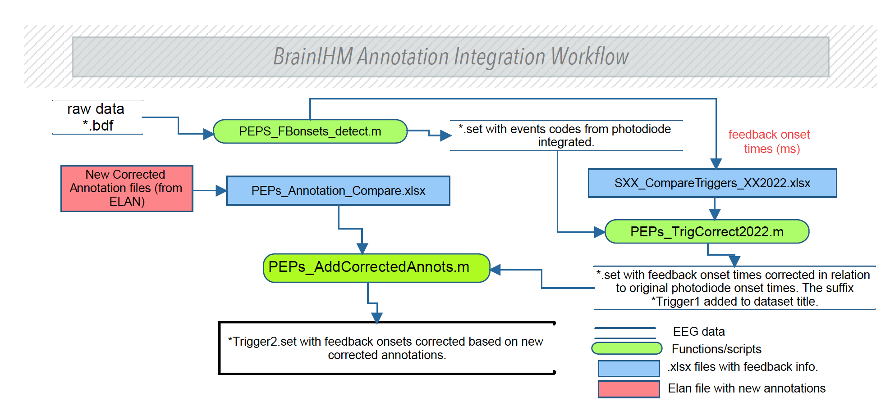

# ProjectBrainIHM_EEG
A suite of scripts in matlab, python and R used to process and analyse the EEG data from the BrainIHM project. 

Figure 1 presents the pipeline for the automatic detection of the feedback onset times using the photodiode signals and the video annotations carried out in the Elan software ([https://archive.mpi.nl/tla/elan]([https://archive.mpi.nl/tla/elan])).

*Figure 1: Overview of the workflow for the automatic detection and coding of feedback onsets using both the photodiode signals and video annotations.*

